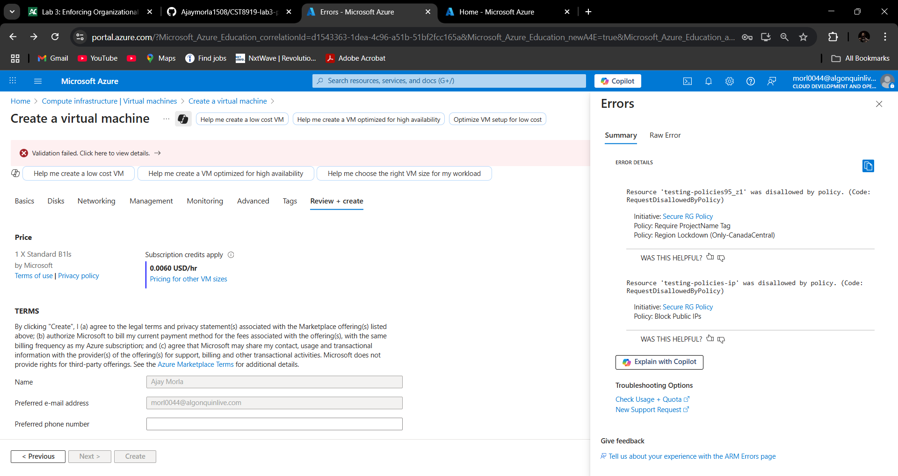
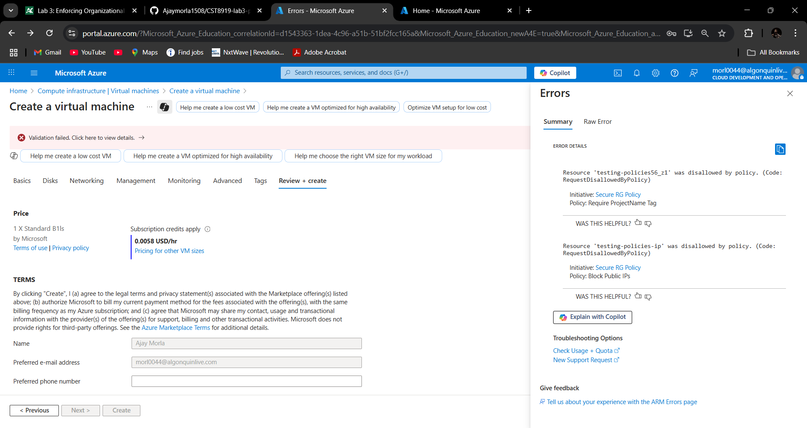
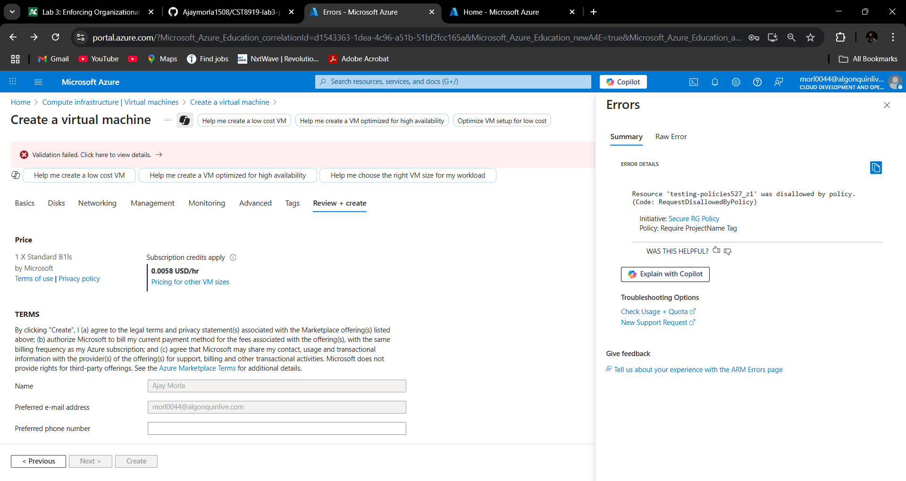
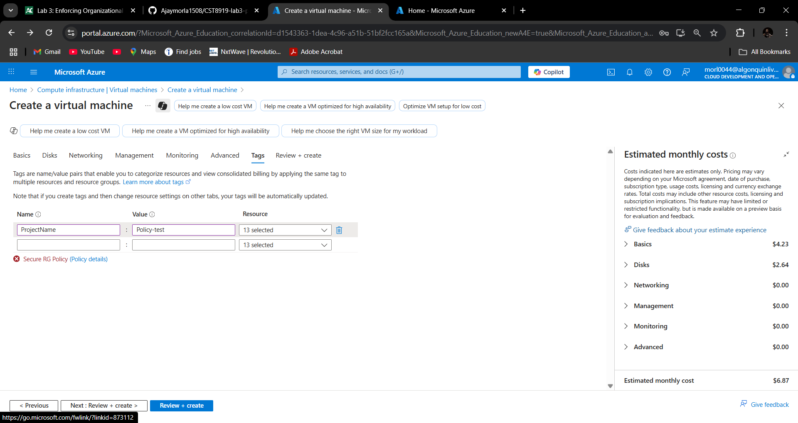
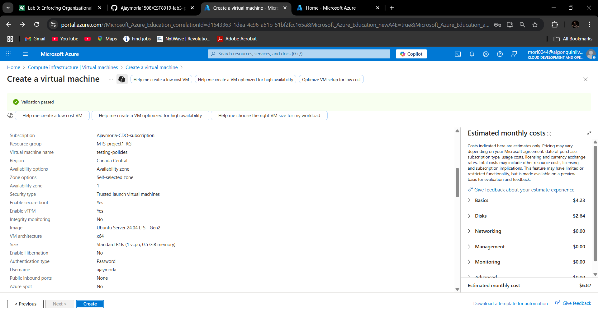

# Lab 3: Enforcing Organizational Policies in the Cloud
**Course**: CST8919 – DevOps Security and Compliance  
**Submitted by**: Ajay Morla

---

## 📘 Lab Overview

At MapleTech Solutions, developers were deploying resources across various regions without proper governance. Our task was to bring structure using **Azure Policy** by enforcing:

- Region restriction to `Canada Central`
- Mandatory tagging using `ProjectName`
- Blocking public IP creation

This document outlines policy definitions, assignment steps, testing commands, and results.

---

## 🔐 Policies Implemented

### 1. 🗺️ Region Lockdown – Only Canada Central

- **Name**: `Only-CanadaCentral`
- **Effect**: `Deny`
- **Description**: Prevents resource deployment in regions other than `Canada Central`.

    ```json
    {
    "properties": {
        "displayName": "Only allow resources in Canada Central",
        "description": "Deny creation of resources not in Canada Central",
        "mode": "All",
        "policyRule": {
        "if": {
            "field": "location",
            "notEquals": "canadacentral"
        },
        "then": {
            "effect": "deny"
        }
        }
    }
    }
    ```
### 2. 🏷️ Require ProjectName Tag

- Name: Require-ProjectName-Tag

- Effect: Deny

- Description: Ensures all resources have a ProjectName tag.

    ```json
    {
    "properties": {
        "displayName": "Require ProjectName Tag",
        "description": "Deny resources without a ProjectName tag",
        "mode": "All",
        "parameters": {
        "tagName": {
            "type": "String",
            "defaultValue": "ProjectName",
            "metadata": {
            "description": "Tag name to enforce",
            "displayName": "Tag Name"
            }
        }
        },
        "policyRule": {
        "if": {
            "field": "[concat('tags[', parameters('tagName'), ']')]",
            "exists": "false"
        },
        "then": {
            "effect": "deny"
        }
        }
    }
    }
    ```
### 3. 🌐 Block Public IPs
- Name: Deny-Public-IP

- Effect: Deny

- Description: Prevents creation of public IP addresses.

    ```json
    {
    "properties": {
        "displayName": "Deny Public IP",
        "description": "Prevent creation of Public IP addresses",
        "mode": "All",
        "policyRule": {
        "if": {
            "field": "type",
            "equals": "Microsoft.Network/publicIPAddresses"
        },
        "then": {
            "effect": "deny"
        }
        }
    }
    }
    ```
### 🧩 Policy Initiative: MapleTech Secure Foundation
    - Name: MapleTech Secure Foundation

    - Policies Included:

    - Only-CanadaCentral

    - Require-ProjectName-Tag

    - Deny-Public-IP

    - Category: Security

    - Assigned To: MTS-project1-RG

    - Enforcement Mode: Enabled

### 🛠️ Policy Assignment & Testing (VS Code)
#### Test Cases and Commands
1. ❌ Deploying VM with default settings – Should Fail cause of policy-intiative
    - Resource Group: MTS-project1-RG 
    - Virtual machine name:	PolicyTestVM
    - Region: Selected(Sweden-Central)
    - Availability options	Leave default
    - Image	Choose any (e.g., Ubuntu 20.04 LTS)
    - Size	Keep default (unless you're testing SKU restriction policy)
    - Public inbound ports	Allow selected ports (e.g., SSH 22)
      
    
Expected: ❌ Denied – Not Canada Central

2. ❌ Changed the region to Canada Central – Should Fail cause remaining policies block
     
Expected: ❌ Denied – Missing required tag, PublicIP should be disabled.

3. ❌ Create Public IP Address – Should Fail
     
Expected: ❌ Denied – Tag Needed(ProjectName)

4. ✅ Deploy VM in Canada Central with ProjectName Tag – Should Succeed

    

Expected: ✅ Allowed – Region and tag compliant, no public IP

  

### Demo Video (10 mins)
[Watch the 5-minute demo on YouTube](https://www.youtube.com/watch?v=kBe15CSoZaU)

### 🧠 Lessons Learned
- Azure Policy is powerful for organization-wide governance.

- JSON policies must be well-formed and specific (especially field usage).

- Initiatives simplify enforcement by grouping policies.

- Even with Deny effects, policy testing is safe and non-destructive.

- Tags and location enforcement help control costs and data residency.

---
